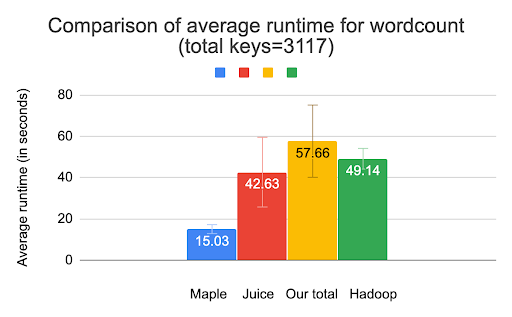
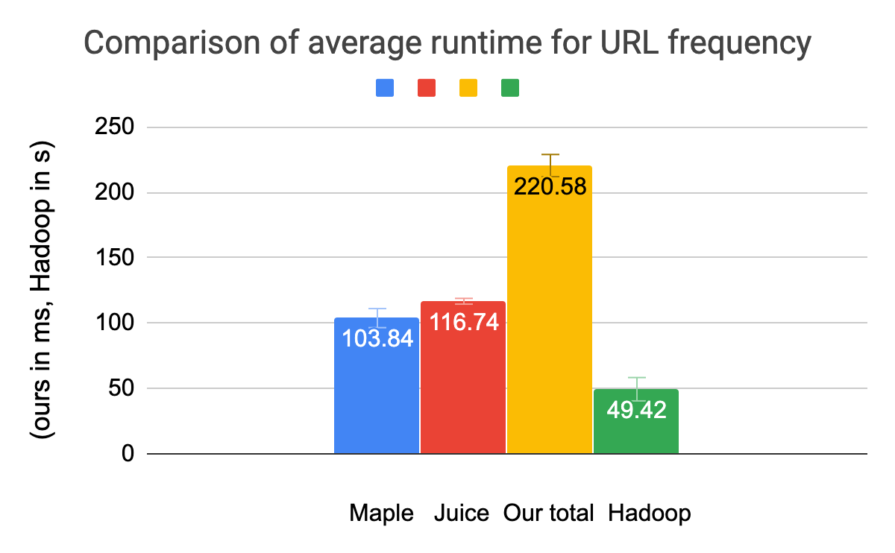

MapleJuice
==========

We have built a Map-Reduce system using components from MP2 (membership protocol) and MP3 (Distributed File System). We have a centralized master server which runs the maple and the juice commands in the system, and maintains the file structure of the whole system and keeps track of the progress of the maple(Map) and juice(Reduce) tasks. Our system can handle failure of the worker nodes during any of the above phases (map, juice).

### Data Structures
- `WorkerNodes`: The nodes chosen for the specific maple or juice task.

#### Maple-related
- `node2mapleJob`: Keeps track of the maple jobs assigned to nodes, which basically tracks which files are being assigned for maple job to nodes. Also tracks the keys the node has generated and which it will be aggregating. This data structure is used for failure handing.
- `keyMapleIdMap`: Keeps track of the files in which the key is present
keyStaus: Keeps track of the status of a given key. It has three states (ONGOING, DONE,FAILED). This tells us about completion status of the mapleTask.
mapleBarrier: Tells us whether the file processing and key extraction stage of the maple has been done or not.
- `keyTimeStamp`: Tells us when the job for this key was submitted, helps us detect soft failures of the system.

#### Juice-related
- `node2mapleJob`: Keeps track of the juice jobs (per key jobs) to nodes, and helps us during failure handling
- `juiceCompMap`: Tells us about the status of the juiceID task, i.e for each intermediate files, what is the status. Tells us about the completion status.
- `juiceTimestamp`: Tells us when the juice task was submitted, helps with the soft failures of the system

### Components of the Design:

#### Maple Task:  
When a maple task is started, the following steps are carried out:
1. Master node check all the files that matches the input prefix and adds them in a list. 
2. Master assigns each file an mapleID and assigns the task to nodes, and keeps track of how many files has been processed.
3. Worker node on receiving a file for processing, runs the mapleExe and gets all the keys, and updates to the master.
4. Master upon receiving all the keys from all the worker nodes, start the process of aggregating the key. It assigns a key to a node for aggregating and sends them the location of nodes containing the relevant files for the key and keeps track of the status of the key.
5. Worker: For key aggregation, it fetches the relevant files from the node as directed by master and upon receiving the files aggregates it in a single file and updates master about the status of the Key, and adds it in the sdfs file system
6. Master on receiving all the keys from all nodes after aggregation finishes the MAPLE job.

#### Juice Task:
1. Master upon receiving the Juice task finds all the relevant files for juice task. 
2. Master assigns worker node each file to process (which are key specific).
3. Worker on receiving juice task runs JuiceExe on the key-specific file and sends it output to master.
4. Master upon receiving updates from all the Juice tasks finishes the juice task.

### Handling Failures:

#### During Maple Phase:
	
1. If the failure happens before all files have been executed with MapleExe, master selects another node as worker and assigns the files corresponding to the failed nodes to it.
2. Otherwise, master check if there is any required keyfile the crashed node handles which hasn’t been aggregated yet, then it runs the complete maple task.
3. If none of the above, tt simply reassigns the keys for aggregation to other nodes.
4. Silent Failure: If a key aggregation for a key hasn’t been received after a timeout, master reassigns the key to other nodes.

#### During Juice Phase:
1. If a node fails then, another node is selected to run its juiceExe. 
2. If a keyJuice times out, master reassigns the key to other nodes

### System Issues:
1. Limit on open connections or open files: While designing we encountered thrashing -- an issue where too much parallelism was causing the system to crash because of many open file descriptors, we mitigated that by using limited tokens for opening files or connections.
2. Too much context switch: When we spawned too many goroutines we observed that the system keeps on waiting and no tasks are completed, hence we kept a check on numbers of token for parallelism in the code.

### Measurements:

For large number of keys, we observe that the time taken by hadoop is lesser and it outperforms our system. Our system faces resource contention and needs to do batching of requests. 

For URL frequency count, we reduced the size of our dataset to see the affect keys size has on the system, hadoop takes similar time to perform as the previous one due to it’s initial setup, but our system performs much faster owing to its low initial overhead.

For datasets (upto key size ~15000) our  system and hadoop has comparable performance, but hadoop scales better -- as our design slows down where the number of keys is high because of resource contention for file transferring.
